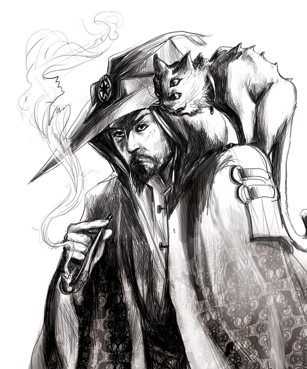

<!--

# Dependencies:

- git-lfs
- inkscape (for composing svg images)
- pdflatex (loads of packages)

# config/

The config directory is a subtree, so don't touch it unless you know what you're doing.

# compiling

> make

# optional

Clone the core book into the same directory, and aif will automatically reference the rules there with page numbers and such.

-->

| Downloads                  | Related Books                  |
|:---------------------------|:-------------------------------|
| [Campaign World][aif]      | [Core book][core]              |
| [Players' Guide][guide]    | [Oneshot Adventure][oneshot]   |

# Adventures in Fenestra

> The towns are only safe so long as the villages feed them.
> The villages are only safe due to the patrols, and their outer walls.
> If we lose another village, the town will fall.
> When we lose the town, we lose the foundries, and swords.
> We'll become like the lost city - an abandoned waste where the trees grow over the churches.
>
> Or you can fight back, join the Night Guard, join us at the forest's border, fight back against the creatures that steal our sheep and scare our horses, and destroy the villages at the border, or you can stand back and watch the world fall to ruin.

Fenestra considers itself the leader in the civilized world, but the forest is full of dangers, and always threaten to reclaim the land.

The dwarves and gnomes live underground.
The elves have their magics to deal with the situation.
Only mankind sits at the precariously beside the menacing nature.

Anyone who has not found a use for themselves can find a use in the Night Guard - the group charged by the Rex to go to the front lines and beat back the forest.

# Resources

## Map of the Land

- Details on Fenestra, the land of magical portals.
- Ethereal lands beyond, where players can get trapped and find strange items.
- Bestiary, for all your monstrous needs.

## Games Master Resources

- Random encounters, random starting-backgrounds for PCs, and other random things.
- One bestiary, with all the creatures of Fenestra.
- Details on the nura - the twisted versions of men, gnomes and dwarves who emerge from underground and consume everything in the area.
- Magical groves, magical wells, magical items, and magical songs.

## Side Quests

Side Quests are a mechanic for presenting open-world adventures.
These storylines are cut up into small encounters, and wherever the players go, they are confronted by the next part of a story.

Unlike traditional adventures, Side Quests always happen *to* the players, so players have no impetus to go anywhere.
Instead, the next part of the story waits for them to arrive, and if they stay put then a different Side Quest rears its head.

A dozen Side Quests are presented for three areas: forest, villages, and town.
You can slot these into an existing campaign if you're low on ideas, or use them as a miniature campaign in their own right.
A few Side Quests reference similar events or share histories, creating a semi-coherent, eclectic narrative.

[aif]: https://gitlab.com/bindrpg/aif/-/jobs/artifacts/master/raw/aif.pdf?job=compile_pdf
[core]: https://gitlab.com/bindrpg/core
[oneshot]: https://gitlab.com/bindrpg/oneshot/-/jobs/artifacts/master/raw/horde_escape_oneshot.pdf?job=compile_pdf
[guide]: https://gitlab.com/bindrpg/aif/-/jobs/artifacts/master/raw/players_guide.pdf?job=compile_pdf
